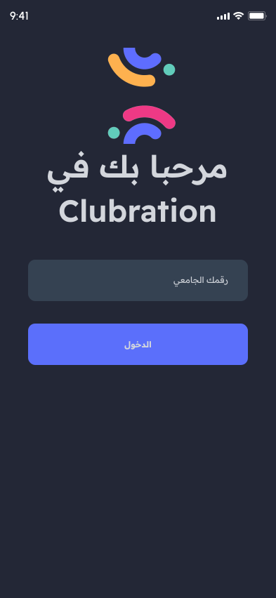
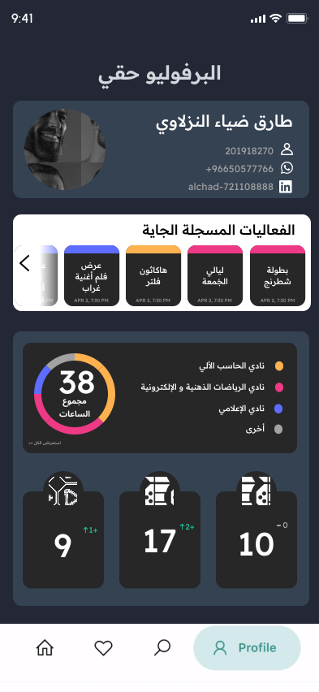
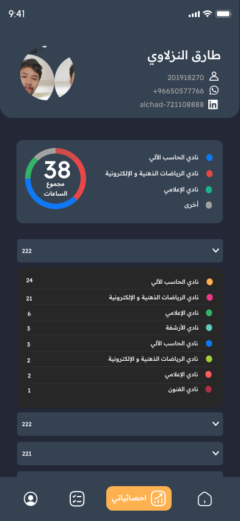

<h1 align="center">
  
  <br>
  Clubration
</h1>

Clubration is a university clubs assistant app that helps club members organize events and distribute tasks. It allows students to view their profiles and have a portfolio page where their contributions to events can be viewed. The app was developed as part of the KFUPM Innovation Hackathon (222).

## Features
### Clubs
- The club presidents can assign a vice-president and moderators.
- Moderator level members (and higher) can create and manage events and tasks.
### Events & Tasks
- After a moderator creates the event and tasks, any member of the club can enroll in organizing the event.
- Members can assign themselves tasks and report back in-app update.
### Profiles
- Students can view the past events they participated in.
- You can compare your achievements with your colleagues. 


## Initial Designs

> Feel free to view the initial designs in [Figma](https://www.figma.com/file/3ogjFsmTrM2cRfUCKInEzA/ClubMaster?node-id=0%3A1&t=oUPDwiaG5mxgYHed-1)
<figure>

<figcaption align="center">
Fig.1 - Welcome to Clubration
</figcaption>
</figure>

<figure>

<figcaption align="center">
Fig.2 - Create an Account
</figcaption>
</figure>

<figure>

<figcaption align="center">
Fig.3 - Account Created
</figcaption>
</figure>

<figure>

<figcaption align="center">
Fig.4 - Login
</figcaption>
</figure>

<figure>

<figcaption align="center">
Fig.5 - Main Page
</figcaption>
</figure>

<figure>

<figcaption align="center">
Fig.6 - Profile
</figcaption>
</figure>

<figure>

<figcaption align="center">
Fig.7 - Portfolio
</figcaption>
</figure>

<figure>

<figcaption align="center">
Fig.8 - Event Page
</figcaption>
</figure>

<figure>

<figcaption align="center">
Fig.9 - Statistics
</figcaption>
</figure>

## Installation

To run the app locally, you will need to have [Flutter](https://flutter.dev/) installed. 
Clone the repository and run:
```
flutter run
```

## Team

- Faisal Alali https://github.com/Faisalalali
- Faris Alnzlaoy https://github.com/FaresFouziNZ
- Abdulrahman Azhar https://github.com/AbudyAzhar
- Dhiaaddin Hamidaddin https://github.com/diax7
- Tarek Aljawi https://github.com/TarekAljawi

# Team

| <a href="https://www.linkedin.com/in/faisalalali/" target="_blank">**Faisal Alali**</a> | <a href="https://www.linkedin.com/in/fares-alnzlawe/" target="_blank">**Faris Alnzlaoy**</a> | <a href="https://www.linkedin.com/in/abdulrahman-azhar-590391207/" target="_blank">**Abdulrahman Azhar**</a> | <a href="https://www.linkedin.com/in/dhiaaddin/" target="_blank">**Dhiaaddin Hamidaddin**</a> | <a href="https://www.linkedin.com/in/tarek-aljawi-823287b3/" target="_blank">**Tarek Aljawi**</a>
|:---:|:---:|:---:|:---:|:---:|
||  |  |||
| <a href="https://github.com/FaisalAlali" target="_blank">`FaisalAlali`</a> | <a href="https://github.com/FaresFouziNZ" target="_blank">`FaresFouziNZ`</a> | <a href="https://github.com/AbudyAzhar" target="_blank">`AbudyAzhar`</a> | <a href="https://github.com/diax7" target="_blank">`diax7`</a> | <a href="https://github.com/TarekAljawi" target="_blank">`TarekAljawi`</a>  |

---
### KFUPM Innovation Hackathon (222)
3rd team
